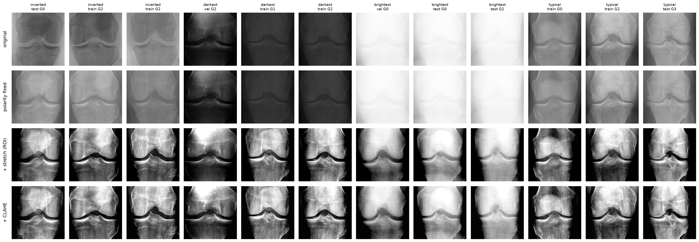
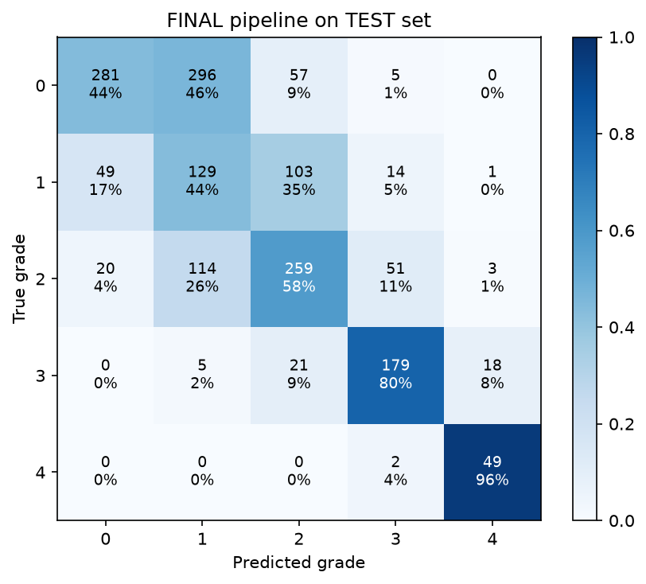
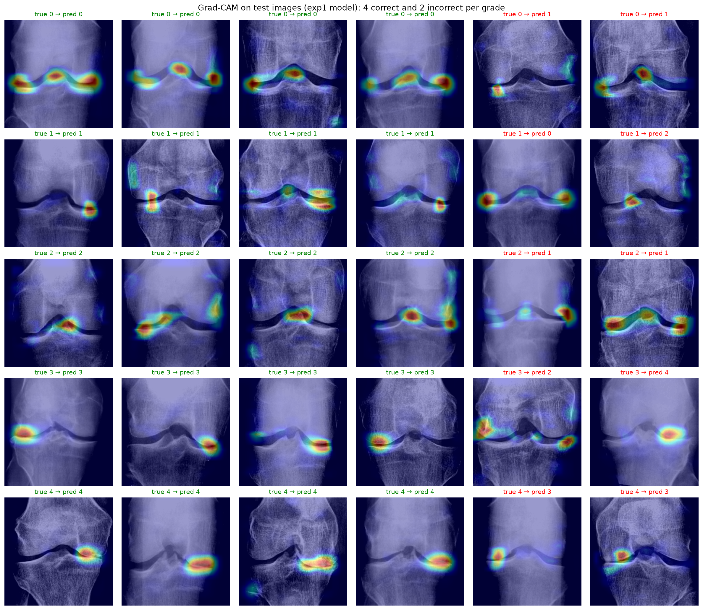
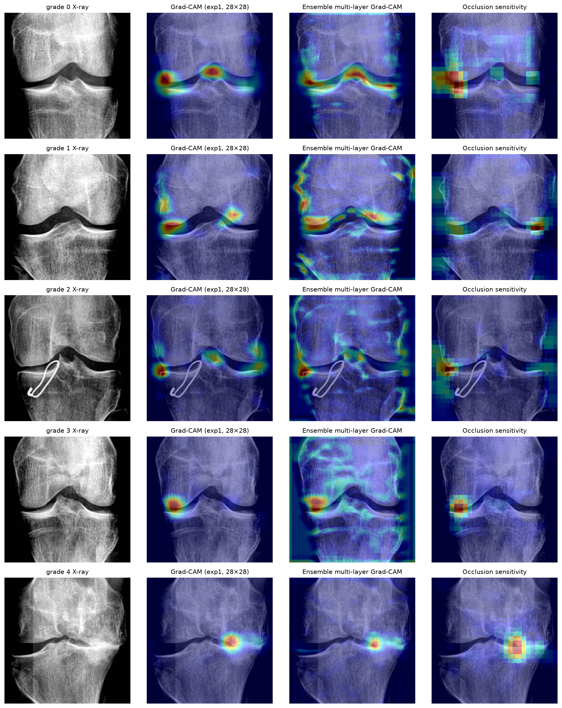

# Knee Osteoarthritis Severity Classification from X-rays

A custom convolutional neural network, designed and trained **from scratch** in TensorFlow, that grades knee osteoarthritis (OA) severity on the **Kellgren–Lawrence (KL) scale (0–4)** from knee X-rays. The project is optimized for **balanced accuracy**, so the model must perform across all five grades, including the rare severe cases, not just the common healthy ones.

| Held-out test set (1,656 X-rays) | Result | 95% confidence interval |
|---|---|---|
| **Balanced accuracy** | **0.644** | 0.621 – 0.666 |
| **Quadratic weighted kappa (QWK)** | **0.753** | 0.730 – 0.775 |
| Severe OA (grade 4) recall | 0.96 | 49 of 51 |
| Moderate OA (grade 3) recall | 0.80 | |

**[Try the live demo](https://huggingface.co/spaces/afzal2003/kneegrade)** (runs entirely in your browser; X-rays never leave your device) · **[Model card on Hugging Face](https://huggingface.co/afzal2003/knee-oa-kl-grading)**

No pretrained weights or transfer learning were used. Explainability analysis shows that 70% of the model's attention falls on the knee joint, which covers 31% of the image, and the explanations pass faithfulness and sanity tests.

> **Not a medical device.** This is a research and portfolio project for radiographic severity classification. It has not been clinically validated and must not be used for diagnosis.

---

## Contents

1. [The problem](#the-problem)
2. [Dataset](#dataset)
3. [What the data exploration found](#what-the-data-exploration-found)
4. [Preprocessing pipeline](#preprocessing-pipeline)
5. [Model and training](#model-and-training)
6. [Experiments](#experiments)
7. [Final pipeline and test results](#final-pipeline-and-test-results)
8. [Explainability](#explainability)
9. [Limitations](#limitations)
10. [Usage](#usage)
11. [Deployment: the KneeGrade web app](#deployment-the-kneegrade-web-app)
12. [Reproducing the results](#reproducing-the-results)
13. [Project structure](#project-structure)
14. [License](#license)
15. [Acknowledgements](#acknowledgements)

---

## The problem

The KL grade is the standard radiographic measure of knee OA severity:

| Grade | Description |
|---|---|
| 0 | Healthy knee |
| 1 | Doubtful joint narrowing with possible osteophytic lipping |
| 2 | Definite osteophytes and possible joint space narrowing |
| 3 | Multiple osteophytes, definite joint space narrowing, mild sclerosis |
| 4 | Large osteophytes, significant joint narrowing, severe sclerosis |

Grading is subjective, especially at the low end: the words "doubtful" and "possible" describe exactly the cases where expert readers disagree. An automated grader applies the same criteria every time and could serve as a consistent second reader or a triage aid that flags likely severe cases for priority review.

**Why balanced accuracy?** The classes are heavily imbalanced (13:1 between grade 0 and grade 4). A model that always predicts "healthy" scores 39.7% plain accuracy but only **20% balanced accuracy**, the average recall across the five grades. Balanced accuracy exposes models that ignore rare grades. QWK is reported alongside it because it penalizes errors by how far they are from the true grade, which respects the ordering of KL grades.

---

## Dataset

[Knee Osteoarthritis Dataset with Severity Grading](https://www.kaggle.com/datasets/shashwatwork/knee-osteoarthritis-dataset-with-severity) (Kaggle), derived from the Osteoarthritis Initiative (OAI) via Pingjun Chen's release on Mendeley Data. Images are pre-cropped to the knee joint, 224×224 grayscale PNGs.

| Split | Grade 0 | Grade 1 | Grade 2 | Grade 3 | Grade 4 | Total |
|---|---|---|---|---|---|---|
| Train | 2,286 | 1,046 | 1,516 | 757 | 173 | 5,778 |
| Validation | 328 | 153 | 212 | 106 | 27 | 826 |
| Test | 639 | 296 | 447 | 223 | 51 | 1,656 |

The provided stratified splits were used as-is. The `auto_test` folder (1,526 images from an automatic joint detector) was excluded. **The test set was not used for any decision** and was evaluated exactly once, on a pipeline committed to Git beforehand.

---

## What the data exploration found

- **110 X-rays (1.3%) are photographic negatives**, with dark bone on a light background. They were found with a centre-minus-edge brightness score whose distribution is cleanly bimodal, with an empty gap between normal and inverted images, so a zero threshold separates them with no misclassifications. Their rate is unevenly spread across grades (0.4–1.8%), so leaving them in risked a spurious, non-anatomical cue.
- **Exposure varies enormously** between images (mean brightness from about 45 to 240), from near-black to almost completely washed out.
- **Image brightness barely differs by grade.** The small upward trend with severity is consistent with real anatomy (sclerosis makes bone denser), so exposure does not leak the label.
- At least one image contains **metal surgical hardware**, a potential shortcut that the explainability analysis later checked for.

---

## Preprocessing pipeline



Each X-ray passes through three steps (`src/preprocessing.py`):

1. **Polarity correction:** inverted images are flipped back (`255 − pixel`). The decision uses only image content, never the label, and applies identically at inference.
2. **Percentile contrast stretch:** the 1st–99th brightness percentiles **of the central joint region** are mapped to 0–255. Measuring on the centre was essential: an earlier version measured on the whole image, and dark soft-tissue edges set the black point, leaving washed-out images still washed out.
3. **CLAHE** (contrast-limited adaptive histogram equalization, clip limit 2.0, 8×8 tiles) for local edge enhancement.

After preprocessing, per-image brightness and contrast distributions are far narrower, so differences between images come mostly from anatomy rather than scanner settings.

---

## Model and training

**Architecture** (`src/models.py`): a VGG-style CNN with four blocks. Each block applies two 3×3 convolutions, each followed by batch normalization and ReLU, then 2×2 max pooling. Filters double per block (32 → 64 → 128 → 256) while the image shrinks 224 → 14. Global average pooling, dropout (0.3) and a 5-way softmax complete the network. **1,175,845 parameters.**

**Training** (`src/train.py`):

- Adam optimizer, learning rate 1e-3, batch size 32, sparse categorical cross-entropy.
- **A custom callback computes validation balanced accuracy every epoch**, and checkpointing and early stopping (patience 12) are driven by it rather than plain accuracy. This is how the model is actually optimized for balanced accuracy.
- The learning rate halves when validation loss plateaus (patience 4, minimum 1e-5).
- **Augmentation** (`src/augment.py`): horizontal flip (left and right knees mirror each other), rotation ±10°, shift ±5%, zoom ±10%, brightness and contrast ±10%. No vertical flips, since they are anatomically meaningless.
- Seed 42. GPU training is not perfectly deterministic, so reruns can vary by about ±0.02 in balanced accuracy.

---

## Experiments

Each experiment changed **one factor** relative to the previous best. All results are on the validation set; the full log with configurations is in `reports/results.csv`.

| Run | Change | Balanced acc. | QWK | Recall g0 / g1 / g2 / g3 / g4 |
|---|---|---|---|---|
| Always predict grade 0 | Floor reference | 0.200 | 0.000 | 1.00 / 0 / 0 / 0 / 0 |
| Baseline CNN | — | 0.591 | 0.556 | 0.38 / 0.08 / 0.84 / 0.74 / 0.93 |
| Exp 1 | + augmentation | 0.613 | 0.721 | 0.77 / 0.09 / 0.75 / 0.61 / 0.85 |
| Exp 2 | + square-root class weights | 0.603 | 0.723 | 0.84 / 0.24 / 0.44 / 0.72 / 0.78 |
| Exp 3 | 1.5× wider network (~2.6M params) | 0.615 | 0.713 | 0.76 / 0.05 / 0.75 / 0.74 / 0.78 |
| Exp 4 | Ordinal (CORAL) output head | 0.555 | 0.725 | 0.57 / 0.33 / 0.65 / 0.42 / 0.81 |
| Exp 5 | Raw images, no preprocessing | 0.589 | 0.693 | 0.86 / 0.03 / 0.56 / 0.72 / 0.78 |
| Ensemble (exp 1 + 3) | Average probabilities | 0.630 | 0.726 | 0.77 / 0.05 / 0.75 / 0.73 / 0.85 |
| **Ensemble + prior adjustment** | **Final pipeline** | **0.647** | **0.712** | 0.43 / 0.51 / 0.65 / 0.72 / 0.93 |

### What the experiments showed

- **Augmentation fixed overfitting.** The train/validation accuracy gap shrank from 27 points (0.85 vs 0.58) to about 6, QWK rose from 0.556 to 0.721, and the baseline's habit of dumping half the healthy knees into grade 2 largely disappeared.
- **Class weights, a wider network and an ordinal head did not improve separation; they moved decision boundaries.** Class weights tripled grade-1 recall but cut grade-2 recall by 0.31, and the net effect was zero. Doubling the parameters bought nothing, and training accuracy did not rise either, so capacity was not the bottleneck. The CORAL ordinal model shifted its cut-points (grade 1 up, grade 3 down) and was excluded from the ensemble after it degraded it.
- **The bottleneck is separating grades 0, 1 and 2.** A diagnostic on the *training* set showed the model recognizes only **9% of grade-1 knees even on images it trained on**. That is a separability problem, consistent with ambiguous "doubtful" labels, not overfitting.
- **Preprocessing helps, mostly through training stability.** On raw images, balanced accuracy was about 0.02 lower, and the model learned nothing for the first 10 epochs (stuck at the 0.20 floor) with large validation-loss spikes throughout. The preprocessed model began learning almost immediately.
- **Prior adjustment** divides each predicted probability by that grade's training-set frequency, removing the model's lean toward common grades. Under standard assumptions, this is the decision rule that maximizes balanced accuracy, and it involves **no tuning on validation data**. It improved balanced accuracy for every model tested on validation.

---

## Final pipeline and test results

**Final pipeline** (`src/predict.py`): preprocessing → average the softmax outputs of exp 1 and exp 3 → divide by training-set grade frequencies → highest score wins. It was committed to Git before the test set was touched, and reproduces the validation result exactly (0.6467).



| Test set | Balanced acc. [95% CI] | QWK [95% CI] | Recall g0 / g1 / g2 / g3 / g4 |
|---|---|---|---|
| **Final pipeline (prior-adjusted)** | **0.644** [0.621, 0.666] | **0.753** [0.730, 0.775] | 0.44 / 0.44 / 0.58 / 0.80 / 0.96 |
| Same ensemble, plain argmax (pre-specified secondary) | 0.646 [0.621, 0.668] | 0.756 [0.729, 0.780] | 0.82 / 0.02 / 0.72 / 0.78 / 0.88 |

Confidence intervals come from 2,000 bootstrap resamples of the test set.

**The pipeline generalizes:** test balanced accuracy (0.644) matches validation (0.647), so a dozen validation comparisons did not overfit model selection. Almost all errors are to an **adjacent** grade; no healthy knee was ever called grade 4.

**An honest finding about prior adjustment.** On the test set, prior adjustment did **not** improve the average over plain argmax (0.644 vs 0.646, well within each other's intervals). Its validation gain of about +0.017 did not replicate. What it does change is **which errors the model makes**:

- **Prior-adjusted:** recognizes grade 1 (recall 0.44), but flags 46% of healthy knees as grade 1 (grade-1 precision 0.24).
- **Argmax:** almost never predicts grade 1 (recall 0.02), effectively merging it into its neighbours, but keeps healthy-knee recall at 0.82.

The frozen pipeline is reported as the primary result because it was committed before testing. In a real deployment the choice would depend on context: a screening tool might accept over-flagging doubtful cases, while a tool aimed at reducing radiologist workload might prefer fewer false alarms.

---

## Explainability



Grad-CAM heatmaps show which regions drove each prediction. Because heatmaps alone can be misleading, they were validated with independent tests:

| Test | Result |
|---|---|
| Share of Grad-CAM signal in the joint band (31% of image area), 300 test images | **73%** (exp 1); **70%** (ensemble, deepest layer) |
| Deletion test, 100 test images (lower area under curve = more faithful) | Occlusion **0.154**, Grad-CAM **0.170**, random regions 0.422 |
| Model-randomization sanity check (Spearman similarity, trained vs untrained network) | **−0.03** (pass: near 0) |
| Agreement between Grad-CAM and occlusion sensitivity | Strong for grades 3–4; partial for grades 0–1 |

**What this shows:**

- **The model reads the joint.** Attention concentrates on the joint line and bone margins, with no meaningful signal on image borders, corners or markers.
- **Attention changes with grade in a clinically sensible way:** spread along the whole joint line for healthy knees (checking that the joint space is normal everywhere), at the joint margins where osteophytes form for grades 1–2, and on the single narrowed compartment for grades 3–4.
- **The explanations are faithful.** Erasing the top 5% of pixels ranked by either method drops the model's confidence from 0.55 to about 0.18. Erasing 50% of the image at random still leaves 0.33.
- **No shortcut learning on surgical hardware.** On a test X-ray with metal hardware in the tibia, all three explanation methods ignore the metal and focus on the joint margin.
- **Errors are judgment errors, not location errors.** In misclassified examples, the model still looks at the joint; it misjudges severity at borderline cases.



A multi-layer Grad-CAM variant (adding a 56×56 layer) was also tested. It produced sharper but noisier maps, with only 51% of the signal in the joint band, so the final tool uses the deepest layer averaged over both ensemble members.

---

## Limitations

- **Possible patient-level leakage.** Most patients contribute both knees, and the public dataset has no patient identifiers, so the left and right knee of one person may fall in different splits. This could make the test results slightly optimistic.
- **Single data source.** All images come from the OAI study. Performance on other hospitals, scanners or populations is unknown, and external validation would be required before any practical use.
- **Grade 1 remains the weak point.** The model cannot reliably separate "doubtful" OA from its neighbours, even on training data. This is consistent with known inter-reader disagreement on grade 1, but it limits the model's usefulness for early detection.
- **Small validation subgroups.** The validation set has only 27 grade-4 images, so per-grade validation figures carry considerable uncertainty.
- **One training run per configuration.** Run-to-run variation is roughly ±0.02 in balanced accuracy, so small differences between experiments should not be over-interpreted.
- **Explanations are validated, not verified.** The heatmaps are shown to be faithful and specific to the joint, but they have not been compared with expert lesion annotations, which this dataset does not include. They show *where* the model looks and that it depends on those regions, not *what* it understands.
- **`adjusted_scores` are not probabilities.** The prior-adjusted scores in the inference output are relative decision scores, not calibrated probabilities.

---

## Usage

The easiest way to try the model is the **[live demo](https://huggingface.co/spaces/afzal2003/kneegrade)**: nothing to install.

To run it locally from the command line, grade one or more knee X-ray images (original, unprocessed files):

```bash
python predict_cli.py path/to/xray1.png path/to/xray2.png
```

Output for each image: the predicted KL grade, the ensemble's probabilities, the prior-adjusted decision scores, and a Grad-CAM figure. All results are written to `predictions/predictions.json`.

```json
{
  "file": "data/raw/test/4/9012867R.png",
  "kl_grade": 4,
  "grade_name": "Severe",
  "model_probabilities": {"0": 0.0001, "1": 0.0001, "2": 0.0029, "3": 0.0364, "4": 0.9605},
  "adjusted_scores": {"0": 0.0, "1": 0.0, "2": 0.0003, "3": 0.0086, "4": 0.991},
  "gradcam_figure": "predictions/9012867R_gradcam.png"
}
```

Options: `--out DIR` sets the output folder, and `--no-gradcam` skips the heatmaps.

**Trained models:** the model files are published on the [Hugging Face Hub](https://huggingface.co/afzal2003/knee-oa-kl-grading) rather than stored in this repository. Download them into `models/` with:

```bash
python -c "from huggingface_hub import hf_hub_download as d; [d('afzal2003/knee-oa-kl-grading', f, local_dir='models') for f in ('exp1_augmentation.keras', 'exp3_aug_wider.keras')]"
```

---

## Deployment: the KneeGrade web app

**[KneeGrade](https://huggingface.co/spaces/afzal2003/kneegrade)** is a five-page web app (dashboard, new analysis, history, model insights, about) built on the frozen pipeline. It shows the predicted grade, the model's probability for every grade, and an adjustable Grad-CAM overlay. Analysis history is saved in the visitor's own browser (IndexedDB) and survives refreshes.

**It runs entirely in the browser.** There is no server: `export_for_web.py` folds each batch-normalization layer into its convolution and exports the weights, and the networks are rebuilt with TensorFlow.js operations. The preprocessing (inverted-image correction, percentile stretch and CLAHE) is reimplemented in JavaScript to match OpenCV and NumPy exactly, and Grad-CAM uses an exact closed-form gradient instead of automatic differentiation. X-rays are never uploaded anywhere.

**Verified against Python on all 826 validation X-rays** (`web/parity.html`):

| Check | Result |
|---|---|
| Preprocessed images identical to Python | 826 of 826, pixel for pixel |
| Predicted grade agrees with Python | 826 of 826 |
| Balanced accuracy | 0.6467 in both |
| Largest probability difference | 0.000116 (GPU floating-point precision) |
| Speed | About 33 ms per X-ray for both networks, laptop GPU via WebGL |

To rebuild and run the site locally:

```bash
python export_for_web.py
cd web && python -m http.server 8000      # then open http://127.0.0.1:8000
```

A **server version** of the same app (FastAPI backend serving the Python pipeline, with a Dockerfile) is in `space/`, for hosting on any platform that runs containers.

---

## Reproducing the results

**Environment:** Ubuntu (tested on WSL2), Python 3.12, TensorFlow 2.21 with GPU support, OpenCV 5.0. Tested on an NVIDIA RTX 4060 laptop GPU (8 GB).

```bash
conda create -n knee-oa python=3.12 -y
conda activate knee-oa
pip install -r requirements.txt
```

On Windows, TensorFlow GPU support requires WSL2; install with `pip install "tensorflow[and-cuda]"`.

**Steps:**

1. Download the dataset from Kaggle and extract it so that `data/raw/` contains `train/`, `val/`, `test/` and `auto_test/`.
2. Run the notebooks in order:

| Notebook | Purpose |
|---|---|
| `01_dataset_exploration.ipynb` | Data checks, inverted-image detection, preprocessing design; writes `data/processed/*.npz` |
| `02_evaluation_harness.ipynb` | Metrics and balanced-accuracy callback, verified on known baselines |
| `03_baseline_cnn.ipynb` | Baseline CNN |
| `04_experiments.ipynb` | Experiments 1–5, diagnostics, ensembling, prior adjustment |
| `05_final_evaluation.ipynb` | Frozen pipeline, test evaluation, Grad-CAM and explanation validation |
| `06_deployment.ipynb` | Publishing the models to the Hugging Face Hub and verifying the published copies |

Each experiment takes roughly 15–30 minutes on the GPU above.

---

## Project structure

```
knee-oa-classification/
├── predict_cli.py            # Command-line inference with Grad-CAM
├── export_for_web.py         # Exports the models and data for the browser app
├── MODEL_CARD.md             # Model card published on the Hugging Face Hub
├── requirements.txt
├── src/
│   ├── preprocessing.py      # Polarity fix, ROI contrast stretch, CLAHE
│   ├── data.py               # .npz loading and tf.data pipelines
│   ├── augment.py            # Training-time augmentation
│   ├── models.py             # Baseline CNN architecture
│   ├── ordinal.py            # CORAL ordinal head (experiment 4)
│   ├── train.py              # Reusable training and evaluation loop
│   ├── evaluation.py         # Metrics, confusion matrices, results log
│   ├── predict.py            # Frozen final pipeline
│   └── gradcam.py            # Grad-CAM, occlusion, deletion test
├── web/                      # KneeGrade static web app (TensorFlow.js), deployed as a Space
│   ├── index.html, app.js, styles.css
│   ├── js/preprocess.js      # Preprocessing, matching the Python pipeline exactly
│   ├── js/model.js           # Network rebuild, ensemble, closed-form Grad-CAM
│   └── parity.html           # Browser vs Python verification
├── space/                    # Server version of the app (FastAPI + Docker)
├── notebooks/                # 01–06, in order
├── reports/                  # Figures, training histories, results.csv
├── data/                     # Not tracked (raw and processed images)
└── models/                   # Not tracked (trained .keras files)
```

---

## License

- **Code:** MIT License (see `LICENSE`).
- **Trained models:** [CC BY 4.0](https://creativecommons.org/licenses/by/4.0/).
- **Dataset:** not included in this repository. Chen, Pingjun (2018). *Knee Osteoarthritis Severity Grading Dataset*. Mendeley Data, V1. DOI: [10.17632/56rmx5bjcr.1](https://doi.org/10.17632/56rmx5bjcr.1). Licensed under [CC BY 4.0](https://creativecommons.org/licenses/by/4.0/). Organized from the [Osteoarthritis Initiative (OAI)](https://oai.epi-ucsf.org/datarelease/). For this project, images were preprocessed (inverted-image correction, contrast stretch, CLAHE) and augmented for training. Neither the dataset authors nor the OAI endorse this project.

---

## Acknowledgements

- **Data:** the Osteoarthritis Initiative (OAI); the knee KL-grading dataset released by Pingjun Chen on Mendeley Data; the Kaggle upload by Shashwat Tiwari.
- **Methods:** Kellgren–Lawrence grading; CLAHE; Grad-CAM (Selvaraju et al.); CORAL ordinal regression (Cao et al.); model-randomization sanity checks for saliency maps (Adebayo et al.).
